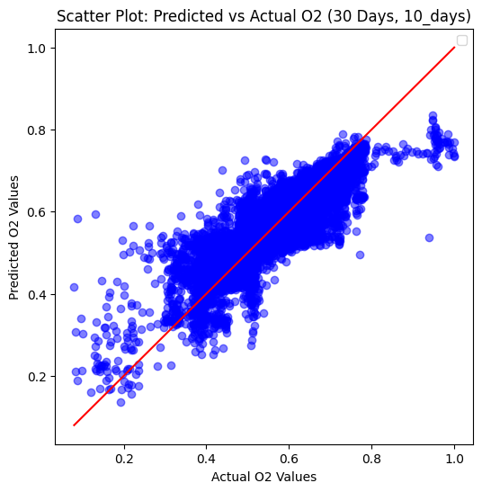
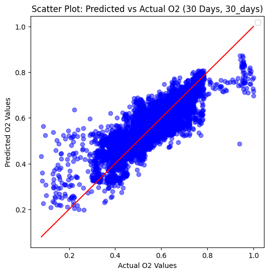

```python
import pandas as pd
import numpy as np
from sklearn.preprocessing import MinMaxScaler
from sklearn.model_selection import train_test_split
import tensorflow as tf
from tensorflow.keras.models import Sequential
from tensorflow.keras.layers import GRU, Dense, Dropout
from tensorflow.keras.optimizers import Adam
```

# Dataset


```python
# Load the dataset

df = pd.read_csv(r"C:\Users\HP User\OneDrive\Desktop\Erdos Deep Learning\dataset.csv")
df = df.drop(columns=['Unnamed: 0'])
```


```python
# Convert the 'date' column to the proper format and sort the data by date

df['date'] = pd.to_datetime(df['date'])  
df = df.sort_values(by='date')  
```


```python
# Specify which features will be used as input and output

features = ['lon_rounded_up', 'lat_rounded_up', 'chl', 'no3', 'po4', 'si', 'salinity', 'temp'] + \
                      [col for col in df.columns if col.endswith('_lag_')]

target = ['o2']

X = df[features].values
y = df[target].values
```

# Normalization of Features and Target Values
Apply Min-Max normalization to the variables to ensure all variables are on the same scale


```python
scaler_X = MinMaxScaler()
X_scaled = scaler_X.fit_transform(X)

scaler_y = MinMaxScaler()
y_scaled = scaler_y.fit_transform(y)
```

# Transform the data into sequences for our GRU model

This function breaks the dataset into sequences, which allows GRU to learn the temporal patterns in the data. Here, we used 30 days of past data to predict future oxygen levels


```python
# Function to create sequences
def create_sequences(X, y, timesteps):
    X_seq, y_seq = [], []
    for i in range(len(X) - timesteps):
        X_seq.append(X[i:i + timesteps])
        y_seq.append(y[i + timesteps])
    return np.array(X_seq), np.array(y_seq)


# Create sequences for 30 days
timesteps_30 = 30
X_seq_30, y_seq_30 = create_sequences(X_scaled, y_scaled, timesteps_30)
```

# Split data nto Training and Testing Sets
We split the sequential data into training and testing sets, with 80% of the data used for training the model and 20% reserved for testing and evaluation.


```python
# Split into training and testing sets (80% training, 20% testing)
split_30 = int(len(X_seq_30) * 0.8)
X_train_30, X_test_30 = X_seq_30[:split_30], X_seq_30[split_30:]
y_train_30, y_test_30 = y_seq_30[:split_30], y_seq_30[split_30:]
```

# Define the GRU Model Architecture and Training the Data

We define the architecture of the GRU model. The model has 64 and 32 units in the first and second layers respectively, a dropout rate of 0.2, and a learning rate of 0.001. The model was trained for 15 epochs and Mean Squared Error (MSE) was used to assess its performance


```python
def build_gru_model(input_shape):
    model = Sequential([
        GRU(64, activation='relu', input_shape=input_shape, return_sequences=True),
        Dropout(0.2),
        GRU(32, activation='relu', return_sequences=False),
        Dropout(0.2),
        Dense(1)  
    ])

    optimizer = Adam(learning_rate=0.001)
    model.compile(optimizer='adam', loss='mse')
    return model
```


```python
def train_and_evaluate_model(X_train, y_train, X_test, y_test, timesteps, future_steps):
    model = build_gru_model((timesteps, X_train.shape[2]))
    
    history = model.fit(X_train, y_train, epochs=15, validation_split=0.2, verbose=1)
    
    y_pred = model.predict(X_test)
    
    mse = model.evaluate(X_test, y_test)
    
    return y_pred, y_test, mse, history
```

# Prediction

We evaluate the model's performance on predicting o2 levels for 10 and 30 days into the future. 


```python
prediction_steps = [10, 30]

results_30_days = {}

for steps in prediction_steps:
    print(f"Evaluating 30-day model for {steps} days prediction...")
    
    y_pred_30, y_test_30, mse_30, history_30 = train_and_evaluate_model(
        X_train_30, y_train_30, X_test_30, y_test_30, timesteps_30, steps
    )
    
    results_30_days[f'{steps}_days'] = {'mse': mse_30, 'history': history_30, 'y_pred': y_pred_30, 'y_test': y_test_30}
```

    Evaluating 30-day model for 10 days prediction...
    Epoch 1/15
    2472/2472 ━━━━━━━━━━━━━━━━━━━━ 112s 43ms/step - loss: 0.0160 - val_loss: 0.0032
    Epoch 2/15
    2472/2472 ━━━━━━━━━━━━━━━━━━━━ 103s 42ms/step - loss: 0.0053 - val_loss: 0.0028
    Epoch 3/15
    2472/2472 ━━━━━━━━━━━━━━━━━━━━ 101s 41ms/step - loss: 0.0041 - val_loss: 0.0024
    Epoch 4/15
    2472/2472 ━━━━━━━━━━━━━━━━━━━━ 97s 39ms/step - loss: 0.0034 - val_loss: 0.0022
    Epoch 5/15
    2472/2472 ━━━━━━━━━━━━━━━━━━━━ 89s 36ms/step - loss: 0.0031 - val_loss: 0.0021
    Epoch 6/15
    2472/2472 ━━━━━━━━━━━━━━━━━━━━ 87s 35ms/step - loss: 0.0028 - val_loss: 0.0021
    Epoch 7/15
    2472/2472 ━━━━━━━━━━━━━━━━━━━━ 92s 37ms/step - loss: 0.0027 - val_loss: 0.0020
    Epoch 8/15
    2472/2472 ━━━━━━━━━━━━━━━━━━━━ 95s 39ms/step - loss: 0.0025 - val_loss: 0.0019
    Epoch 9/15
    2472/2472 ━━━━━━━━━━━━━━━━━━━━ 104s 42ms/step - loss: 0.0024 - val_loss: 0.0018
    Epoch 10/15
    2472/2472 ━━━━━━━━━━━━━━━━━━━━ 102s 41ms/step - loss: 0.0023 - val_loss: 0.0019
    Epoch 11/15
    2472/2472 ━━━━━━━━━━━━━━━━━━━━ 104s 42ms/step - loss: 0.0022 - val_loss: 0.0018
    Epoch 12/15
    2472/2472 ━━━━━━━━━━━━━━━━━━━━ 101s 41ms/step - loss: 0.0022 - val_loss: 0.0020
    Epoch 13/15
    2472/2472 ━━━━━━━━━━━━━━━━━━━━ 101s 41ms/step - loss: 0.0020 - val_loss: 0.0017
    Epoch 14/15
    2472/2472 ━━━━━━━━━━━━━━━━━━━━ 102s 41ms/step - loss: 0.0020 - val_loss: 0.0018
    Epoch 15/15
    2472/2472 ━━━━━━━━━━━━━━━━━━━━ 102s 41ms/step - loss: 0.0020 - val_loss: 0.0017
    773/773 ━━━━━━━━━━━━━━━━━━━━ 10s 12ms/step
    773/773 ━━━━━━━━━━━━━━━━━━━━ 9s 12ms/step - loss: 0.0016
    Evaluating 30-day model for 30 days prediction...
    Epoch 1/15
    2472/2472 ━━━━━━━━━━━━━━━━━━━━ 104s 40ms/step - loss: 0.0178 - val_loss: 0.0047
    Epoch 2/15
    2472/2472 ━━━━━━━━━━━━━━━━━━━━ 94s 38ms/step - loss: 0.0054 - val_loss: 0.0026
    Epoch 3/15
    2472/2472 ━━━━━━━━━━━━━━━━━━━━ 98s 40ms/step - loss: 0.0044 - val_loss: 0.0022
    Epoch 4/15
    2472/2472 ━━━━━━━━━━━━━━━━━━━━ 101s 41ms/step - loss: 0.0036 - val_loss: 0.0022
    Epoch 5/15
    2472/2472 ━━━━━━━━━━━━━━━━━━━━ 101s 41ms/step - loss: 0.0032 - val_loss: 0.0020
    Epoch 6/15
    2472/2472 ━━━━━━━━━━━━━━━━━━━━ 98s 40ms/step - loss: 0.0029 - val_loss: 0.0020
    Epoch 7/15
    2472/2472 ━━━━━━━━━━━━━━━━━━━━ 101s 41ms/step - loss: 0.0027 - val_loss: 0.0019
    Epoch 8/15
    2472/2472 ━━━━━━━━━━━━━━━━━━━━ 101s 41ms/step - loss: 0.0026 - val_loss: 0.0020
    Epoch 9/15
    2472/2472 ━━━━━━━━━━━━━━━━━━━━ 101s 41ms/step - loss: 0.0024 - val_loss: 0.0018
    Epoch 10/15
    2472/2472 ━━━━━━━━━━━━━━━━━━━━ 100s 41ms/step - loss: 0.0023 - val_loss: 0.0018
    Epoch 11/15
    2472/2472 ━━━━━━━━━━━━━━━━━━━━ 100s 41ms/step - loss: 0.0023 - val_loss: 0.0017
    Epoch 12/15
    2472/2472 ━━━━━━━━━━━━━━━━━━━━ 101s 41ms/step - loss: 0.0022 - val_loss: 0.0018
    Epoch 13/15
    2472/2472 ━━━━━━━━━━━━━━━━━━━━ 101s 41ms/step - loss: 0.0021 - val_loss: 0.0018
    Epoch 14/15
    2472/2472 ━━━━━━━━━━━━━━━━━━━━ 101s 41ms/step - loss: 0.0020 - val_loss: 0.0017
    Epoch 15/15
    2472/2472 ━━━━━━━━━━━━━━━━━━━━ 100s 40ms/step - loss: 0.0019 - val_loss: 0.0016
    773/773 ━━━━━━━━━━━━━━━━━━━━ 10s 12ms/step
    773/773 ━━━━━━━━━━━━━━━━━━━━ 9s 12ms/step - loss: 0.0016
    

# Scatter plot of predicted vs actual values

A scatter plot was used to assess how closely the model's predictions of o2 levels match the actual data.


```python
import matplotlib.pyplot as plt
import numpy as np

def scatter_plot(y_pred, y_test, title, file_name):
    plt.figure(figsize=(6, 6))
    
    # Scatter plot of predicted vs actual
    plt.scatter(y_test, y_pred, alpha=0.5, color='blue')
    
    # Plot the ideal line (perfect prediction)
    min_val = min(min(y_test), min(y_pred))
    max_val = max(max(y_test), max(y_pred))
    plt.plot([min_val, max_val], [min_val, max_val], color='red')
    
    plt.xlabel('Actual O2 Values')
    plt.ylabel('Predicted O2 Values')
    plt.title(title)
    plt.legend()
    
    # Save the plot as a PNG file
    plt.savefig(r'C:\Users\HP User\OneDrive\Desktop\Erdos Deep Learning\plot.png')
    
    # Display the plot
    plt.show()

# Example usage
for key, result in results_30_days.items():
    y_pred = result['y_pred']
    y_test = result['y_test']
    mse = result['mse']
    
    print(f"30-Day Sequence - {key} - MSE: {mse}")
    
    # Generate file name dynamically based on key
    file_name = f'predicted_vs_actual_O2_{key}.png'
    
    scatter_plot(y_pred, y_test, f'Scatter Plot: Predicted vs Actual O2 (30 Days, {key})', file_name)
```

    30-Day Sequence - 10_days - MSE: 0.0018525579944252968
    

    C:\Users\HP User\AppData\Local\Temp\ipykernel_2744\758532040.py:18: UserWarning: No artists with labels found to put in legend.  Note that artists whose label start with an underscore are ignored when legend() is called with no argument.
      plt.legend()
    


    

    


    30-Day Sequence - 30_days - MSE: 0.0017966858576983213
    


    

    

